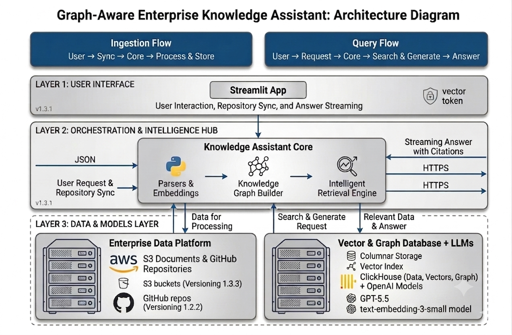

# Enterprise Engineering Knowledge Assistant

A specialized **Retrieval-Augmented Generation (RAG)** search system for software engineering codebases. Ask questions about your architecture, trace data lineage, or understand undocumented pipelines — powered by an intelligent Knowledge Graph.



---

## What it does

| You want to | What happens |
|---|---|
| *"Search for specific code syntax"* | BM25 Keyword Search runs natively in ClickHouse |
| *"Ask semantic architectural questions"* | Cosine Vector Search matches conceptual code chunks |
| *"Understand cross-file impacts"* | Relationship Graph expands context to adjacent upstream/downstream files |
| *"Ensure data security"* | PII Shield scrubs emails and IPs before LLM processing |
| *"Filter by language or topic"* | Dynamic Intent Scoping boosts relevant folders based on query |

---

## Stack

| Component | Role |
|---|---|
| [Streamlit](https://streamlit.io) | Interactive chat interface and document uploader |
| [ClickHouse Cloud](https://clickhouse.com) | Vector database, Full-Text Search engine, and Graph storage |
| [OpenAI](https://openai.com) | Fast vector embeddings (`text-embedding-3-small`) and Generation (`gpt-4o-mini`) |
| [AWS S3](https://aws.amazon.com/s3/) | Scalable storage bucket for raw document ingestion |
| [Python 3.10+](https://python.org) | AST Parsing, Orchestration, and Data Ingestion |

---

## Prerequisites

- Python 3.10+
- A [ClickHouse Cloud](https://clickhouse.com) account and cluster credentials
- An [OpenAI](https://openai.com) API key for embeddings and chat generation
- An [AWS](https://aws.amazon.com/) account with S3 access keys for document storage

---

## Data schema

The knowledge graph and embeddings are stored inside ClickHouse. Here are the core tables driving the engine:

```sql
-- embeddings
-- Stores the 1536-dim vectors for semantic search
CREATE TABLE embeddings (
    chunk_id String,
    embedding Array(Float32)
) ENGINE = MergeTree()
ORDER BY chunk_id;

-- relationships
-- Stores the dependency graph linking code files and configs
CREATE TABLE relationships (
    source_path String,
    target_path String,
    source_chunk_id Nullable(String),
    target_chunk_id Nullable(String),
    rel_type String,
    metadata String
) ENGINE = MergeTree()
ORDER BY (source_path, target_path);
```

---

## Setup & Installation

**1. Clone the repository**
```bash
git clone https://github.com/krishna-patil19/Enterprise-knowledge-assistant.git
cd Enterprise-knowledge-assistant
```

**2. Create and activate a virtual environment**
```bash
python -m venv .venv
source .venv/bin/activate       # On Linux/macOS
.venv\Scripts\activate          # On Windows
```

**3. Install Dependencies**
```bash
pip install -r requirements.txt
```

**4. Configure Environment Variables**
Create a `.env` file in the root directory:
```env
OPENAI_API_KEY=your_openai_api_key_here

# ClickHouse Cloud Database Connections
CLICKHOUSE_HOST=your-clickhouse-cloud-endpoint.aws.clickhouse.cloud
CLICKHOUSE_PORT=8443
CLICKHOUSE_USER=default
CLICKHOUSE_PASSWORD=your_clickhouse_cloud_password_here

# AWS Credentials for S3 Ingestion
AWS_ACCESS_KEY_ID=your_aws_access_key
AWS_SECRET_ACCESS_KEY=your_aws_secret_key
AWS_REGION=us-east-1
```

---

## Running the Application

**1. Run Diagnostics (Optional)**
Check that you can connect to ClickHouse Cloud:
```bash
python check_ch.py
```

**2. Index the Base Files**
Ingest files from the local directory to ClickHouse Cloud:
```bash
python -m backend.ingestion.pipeline
```
*(You can also trigger a re-index directly from the Sidebar button in the Streamlit UI).*

**3. Run the Streamlit Frontend UI**
```bash
streamlit run app.py
```
Open [http://localhost:8501](http://localhost:8501) in your browser.

---

## Monitoring the Database
You can query the live status and tables in your ClickHouse Cloud cluster directly from the command line:
```bash
python query_db.py
```
This utility outputs:
1. Lists of files currently indexed.
2. Summaries of chunk content previews.
3. Node relationship linkages.
4. Total statistics (count of files, chunks, vectors, and links).
